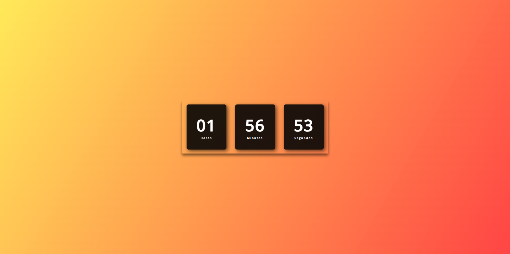

## Visão Geral

### O projeto

- Criar um relógio digital

### Screenshot

### Links

- Live Site URL: [Relógio digital](https://relogio-digital-nu.vercel.app/)

## Meu processo

### Criado com

- HTML
- CSS
- JavaScript

### O que eu aprendi

- setInterval()
- new Date()
- getHours()
- getMinutes()
- getSeconds()

## Autor

- GitHub - [João Metzdorf](https://github.com/joaometzdorf)
